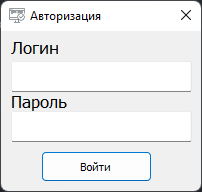
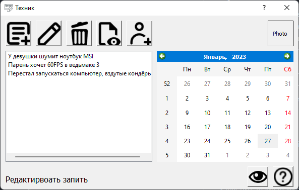
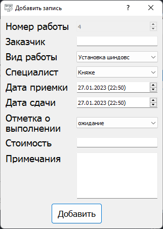
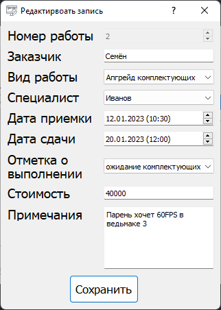
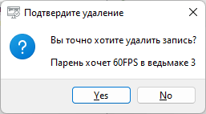
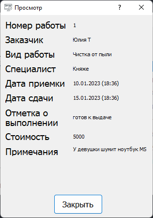
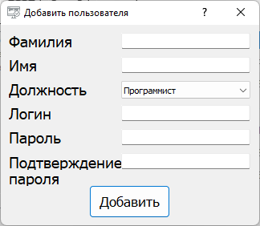

# CRM для сервисного центра техники
### Руководство пользователя
* Запустив программу отображается окно авторизации(login: Admin, password: Admin)
* После авторизации пользователь попадет в главное меню программы
* МЕНЮ:
  * Кнопка - "Создать запись" - отобразится окно для добавления новой записи в базу данных.
  * Кнопка - "Редактировать запись" - отобразится окно для редактирования выделенной записи в базе данных.
  * Кнопка - "Удались запись" - удаляет запись из базы данных.
  * Кнопка - "Просмотреть запись" - отображает окно для просмотра выделенной записи.
  * Кнопка - "Добавить пользователя" - отобразится окно для добавления нового пользователя в базу данных.
  * Поле - "Учётная запись" - TODO.
  * Поле - "Список заказов" - поле для отображения всех заказов хранящихся в базе данных.
  * Поле - "Календарь заказов" - TODO.
  * Кнопка - "Руководство пользователя" - отобразится окно, в котором можно ознакомится с руководством пользователя.
  * Кнопка - "Режим для слабовидящих" - TODO.
* .
* .
* .
* .

### Особенности
* Реализована одиночная игра с рандомной генерацией уровня.
* Реализованны бустеры (ускорение/замедление шарика, разтроение шарика, дополнительные 100 очков) рандомно генерируемые в блоках.
* Во время игры идёт подсчёт очков.
* Проработанное поведение шариков при столкновении с платформой и блоками и также их углами, столкнопения со стенками и столкновения шариков друг с другом.
* В случае если уровень пройден, ваше имя попадает в таблицу лидеров, если вы уже там есть, то результаты суммируются.

### Структура файлов

      |- main.py - программный код приложения (входная точка)

      |- identifier.sqlite - база данных

      |- forms - папка с формами

      |- images - папка с файлами изображений

      |- info - текстовый файл, руководство пользователя

### Иерархия классов
* Класс ***UiA*** наследник ***autoresationForm***

Описывает форму авторизации.
* Классы: ***addForm***, ***editForm***, ***mainForm***, ***userForm***, ***viewForm***

Классы вёрстки
* Класс ***UiD*** наследник ***addForm***
.khjkj
* Класс ***UiE*** наследник ***editForm***
. 
* Класс ***UiM*** наследник ***mainForm***
.
* Класс ***UiU*** наследник ***userForm***
.
* Класс ***UiV*** наследник ***viewForm***
.

### Функции
* main(scr)
Основная функция игры.
* start(scr)
Функция для запуска игорового процесса.
* statistic(scr)
Функция для отображения доски лидеров.
* move_platform(platform, move_right, move_left)
Функция для передвижения платформы.
* detect_collision(dx, dy, ball, rect)
Функция для расчётов направления движения шарика после его столкновения с объектом.
* lose_or_win(balls, map)
Функция для определения победы или проигрыша.
* write_result(name, score)
Функиця для записи результатов в таблицу лидеров.
### Требования
Все требования в requirements.txt

### Запуск
Запустить файл main.py

Ввести имя или никнейм

Выбрать "Играть"

Проходим уровень

### TODO
* Аватар пользователя
* Режим для слабовидящих
* Отображение в календаре заказов
